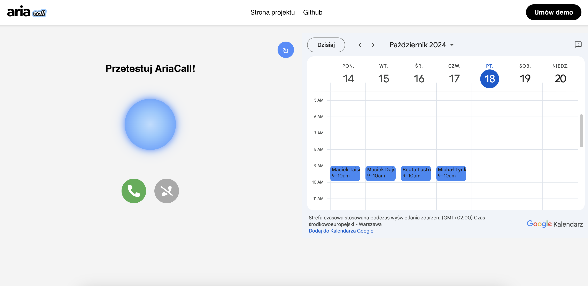

# AriaCall: AI-powered receptionist for dental clinics

AriaCall is an advanced AI-powered receptionist designed specifically for dental clinics. It answers every call, schedules appointments, provides information, and is fully integrated with your clinic’s calendar and management system. Powered by the latest generative AI and voice technologies, AriaCall ensures seamless, professional, and personalized patient communication around the clock.



## Features:
- 🏁 **Real-time interaction:** Responds to patients with low latency, typically within 1 second, using streaming technology.
- 🗣️ **Appointment scheduling:** Automatically schedules, reschedules, or cancels appointments in your clinic's calendar.
- 🗓️ **Calendar checking:** Provides real-time updates on available appointment slots based on your calendar.
- 💬 **Dynamic conversations:** AriaCall can switch topics if patients have additional queries, maintaining a natural flow of conversation.
- 📔 **Conversation history:** Tracks chat history for smooth interaction and better patient communication.
- 🛠️ **Tool integration:** AriaCall can call external tools and APIs to provide real-time data or actions.

## Project Structure
The project is divided into two main directories:
- **backend/**: Contains the server-side code.
- **frontend/**: Contains the client-side code, written in React.js.

## Setting Up for Development

### Prerequisites
Before you start, ensure you have accounts and API keys for the following services:
- [Deepgram](https://deepgram.com) for speech-to-text.
- [ElevenLabs](https://elevenlabs.io) for text-to-speech.
- [OpenAI](https://platform.openai.com) for GPT responses.

### 1. Configure Backend Environment Variables
In the `backend/` directory, create a `.env` file and configure the following environment variables:

```bash
SERVER="yourserverdomain.com"
OPENAI_API_KEY="sk-XXXXXX"
DEEPGRAM_API_KEY="YOUR-DEEPGRAM-API-KEY"
ELEVENLABS_API_KEY="YOUR-ELEVENLABS-API-KEY"
FROM_NUMBER='+12223334444'
TO_NUMBER='+13334445555'
```

### 2. Install Backend Dependencies
Navigate to the `backend/` directory and install the necessary packages:

```bash
cd backend
npm install
```

### 3. Install Frontend Dependencies
Navigate to the `frontend/ directory and install the necessary packages:

```bash
cd frontend
npm install
```

### 4. Configure Frontend Environment Variables
In the frontend/ directory, create a .env file and configure the following login environment variables:

```bash
REACT_APP_USERNAME=********
REACT_APP_PASSWORD=********
```

### 5. Start the Backend Server in Development Mode
In the `backend/` directory, run the following command:

```bash
npm run dev
```

### 6. Start the Frontend Application
In the frontend/ directory, run:

```bash
npm start
```

### 7. Access the Application
Open your browser and navigate to `http://localhost:3000`to access the frontend application.

### How AriaCall Works
AriaCall orchestrates interactions between multiple services (Deepgram, OpenAI, ElevenLabs) to handle voice calls in real time:

1. **Deepgram** transcribes the audio and returns text in real time.
2. **OpenAI** GPT processes the text and generates responses.
3. **ElevenLabs** converts GPT’s text into speech, which is sent back and played to the caller.

...and everything should start up for you! 🚀
___
Aria